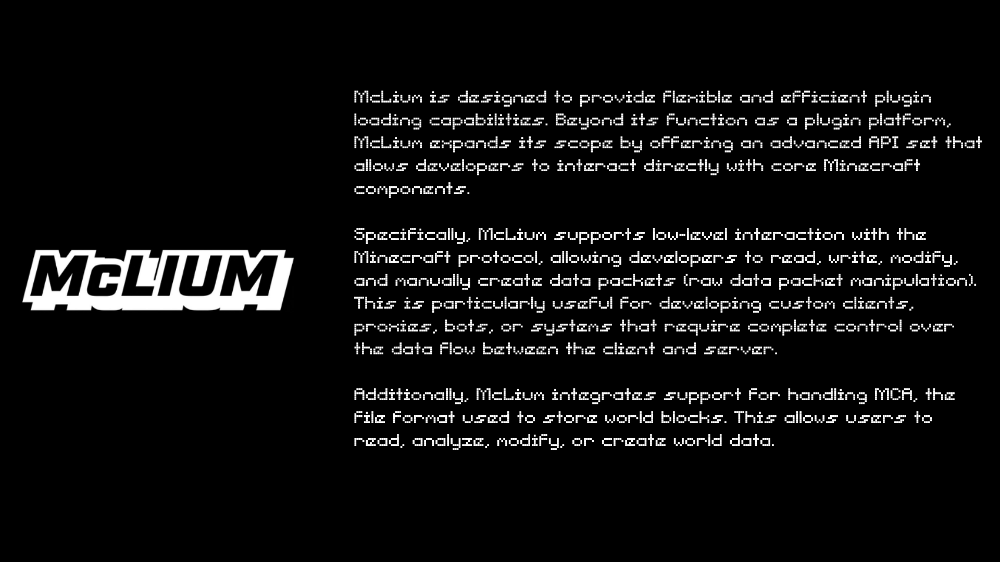
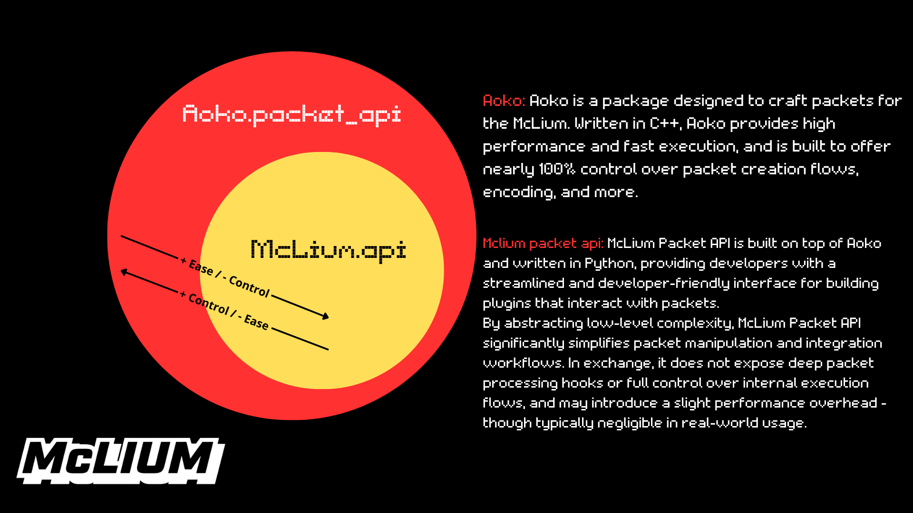
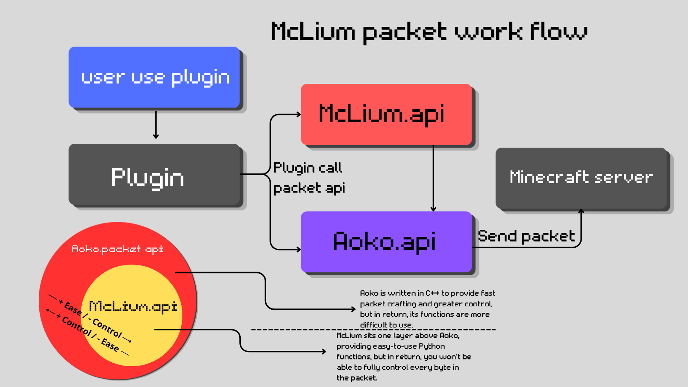

# 📦 McLium

<p align="center">
  
</p>

**McLium is developed strictly for educational purposes and authorized security research only.**
---
# 📦 McLium Protocol API 
<p align="center">
    
</p>

<p align="center">
    
</p>


---
# 📄 Documentation

Comprehensive guides for developing and extending McLium:

- **Plugin Development Guide**  
  https://github.com/Notkenftr/McLium/blob/main/docs/how_to_make_a_plugin.md

- **Packet Creation Guide**  
  https://github.com/Notkenftr/McLium/tree/main/docs/how_to_create_a_packet.md
---
# 📑 Installation

## 1. Clone repository
```bash
git clone https://github.com/your-username/McLium.git
cd McLium
```

## 2. Create virtual environment (recommended)

### Linux / macOs
```bash
python -m venv .venv
source .venv/bin/activate   
```

### Window
```bash
python -m venv .venv
.venv\Scripts\activate 
```

## 3. Run McLium
```bash
python Mclium.py --help
```
[!star_history](https://www.star-history.com/?repos=Notkenftr%2FMcLium&type=date&legend=top-left)

**McLium breaks your limits**